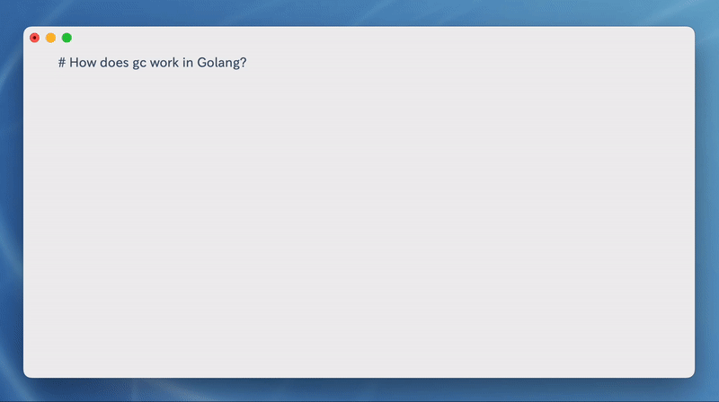

# chatAlfred
ChatGPT API with alfred

__Just type in `\\chat`__

## demo

## First of all
Fill you openai apikey to the variables list.
You can get you own apikey on the page. 
https://platform.openai.com/account/api-keys

## how to use
1. type `\\chat`
2. write some thing to chatgpt
3. auto wrtie to current textbox and paste

